# Unity Shader 着色器特效

### 1、顶点动画

  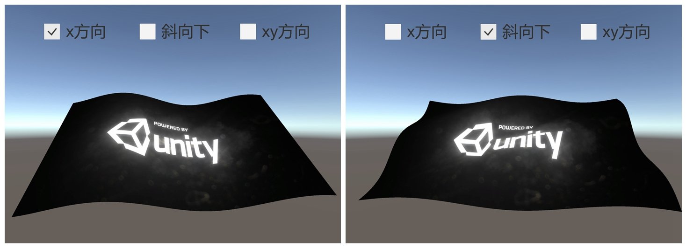 
 

### 2、纹理动画

  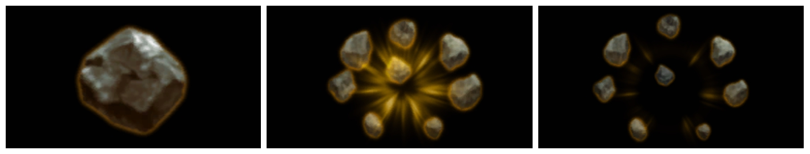 
 

### 3、边缘发光

  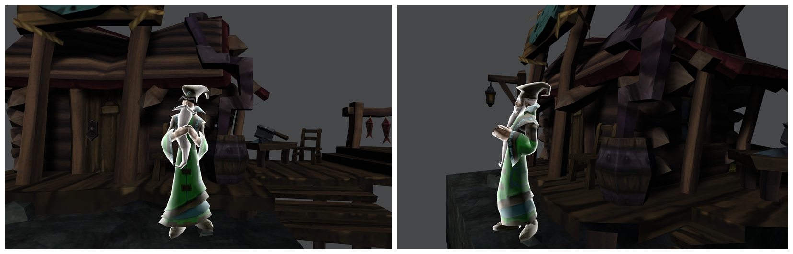 
 

### 4、描边效果

  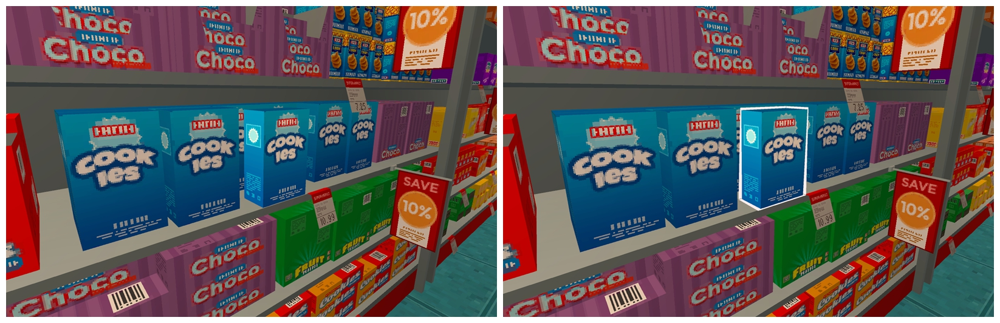 
 

### 5、遮挡透视效果

  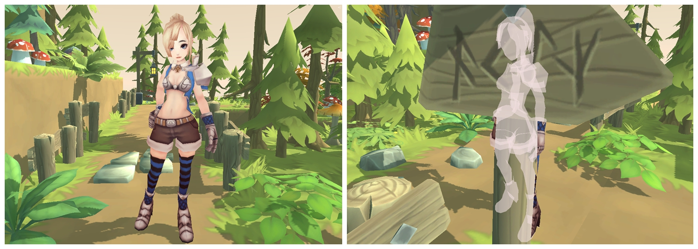 
 

### 6、菲尼尔效果

  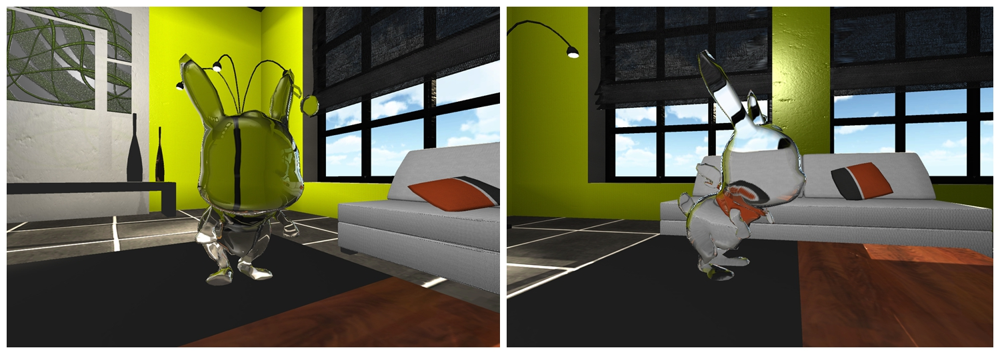 
 

### 7、高斯模糊

  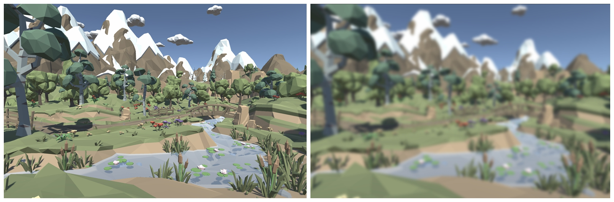 
 

### 8、Bloom 效果

  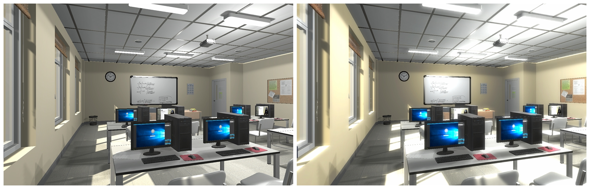 
 

### 9、景深

  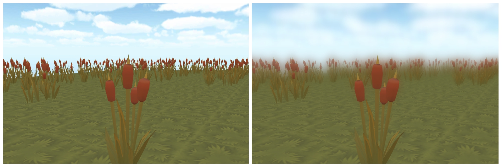 
 

### 10、积雪效果

  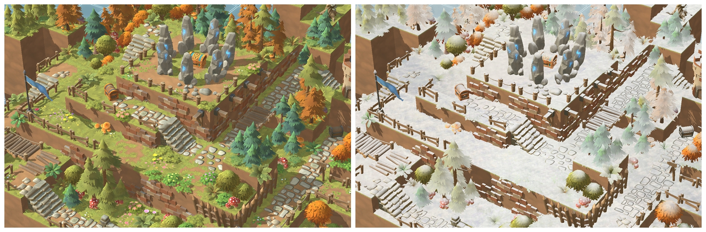 
 

### 11、浴室玻璃

  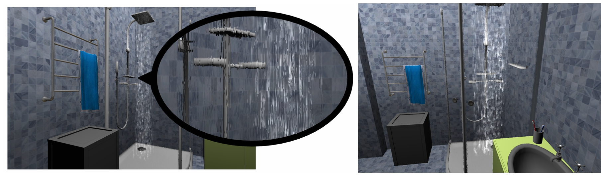 
 

### 12、消融效果

  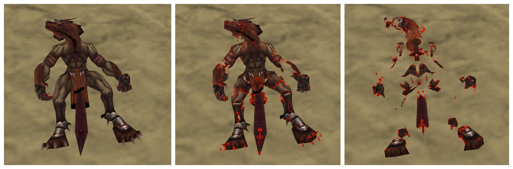 
 